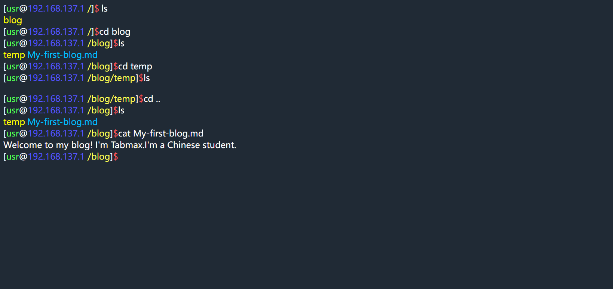

# 说明

这是一个基于**Javascript**的简单终端，支持相对路径，目前功能少的可怜，代码凌乱，仅供学习研究。

请不要尝试去找命令上的BUG，都是特性！比如ls，只能列举当前目录。至于什么命令注入，懒得修。

我的操作系统为Windows，对Linux不熟悉，如有错误，欢迎指正

## 注意！！！请不要直接双击打开index.html，它需要请求**data.json**，会报错！

报错如下

```错误
已拦截跨源请求：同源策略禁止读取位于 file:///XXXX/data.json 的远程资源。（原因：CORS 请求不是 http）。
```
自己搜索:[搭建本地server](https://debug-tab.github.io/baiduyx/index.html?搭建本地server)

如果你使用**Webstorm**之类的编辑器，一般可以在本地搭建server

运行后，网址类似localhost:1234/123/index.html

举几个例子

### Python
如果有Python的话，命令
```cmd
cd 项目目录
python -m http.server 7089
```
打开localhost:7089/index.html就可以了

### npm
```cmd
cd 项目目录
npm install http-server -g
http-server -c-1
```
接着打开localhost:8080

# 功能
## 命令

目前实现命令: 

- ls (列举文件和文件夹)

- cd (进入目录)

- cat (查看文件内容)

- clear (清屏)

- update (更新)

- sudo (存粹好玩)

- mkdir (创建文件夹)

文件/文件夹操作命令正在制作中。但是有个问题，以前都是获取路径后，递归获取文件夹数据，怎么修改是个大问题，得到的只是数据，操作也没用。如有想法，欢迎留言。
## 文件

作为一个终端，当然需要操控文件了

此项目使用json文件模拟文件/文件夹结构，数据存放在**data.json**里

默认会尝试读取**cookie**的**file**属性，如果失败，则会请求data.json后会把它编码放到cookie里。因此，如果你改变了data.json，请在浏览器打开index.html后，运行**update**命令，它会自动请求更新。

### 文件结构

如果data属性是**列表**的话，则认为它是文件夹

比如在根目录有一个文件**test.py**和文件夹**temp**，则这样写json:

```json
{
  "name": "/",
  "type": "dir",
  "data": [
    {
      "name": "test.py",
      "data": "print('Hello World!')"
    },
    {
      "name": "temp",
      "data": []
    }
  ]
}
```

### 优化调整

这种写法无疑很没有效率，可以尝试优化，比如，可以通过判断data类型来确认是文件夹还是文件（已做到！），也可以把data替换为字典。但是没时间。。。

# 原理

主要程序都在 **/js/main.js** 里

## 运行

运行的命令都是js函数

输入是由一个无边框的input标签实现的，当按下任意键时，会检测是否为回车，如果是，则执行**run()**函数。此函数会自动获取并分割输入框内容，如果包含在**cmd_head**列表里，则执行此函数，并传入参数**argv**(分割后的列表)。函数运行结束后，会返回一个HTML标签字符串，run函数返回它，并交给**Render**(渲染)函数处理。

## 渲染

不能叫做渲染，其实就是在input标签前加入运行结果和新的提示语，但是上一个输入会被清空，只能在运行结果前放一个包含上一个命令的span标签


# 未完待续。。。(手动狗头)
