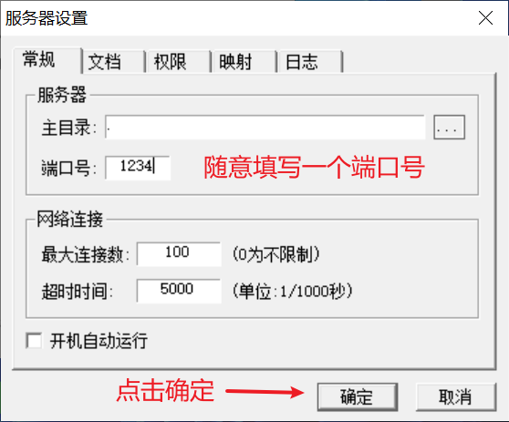

# 说明

请不要尝试去找命令上的BUG，都是特性！比如ls，只能列举当前目录。至于什么命令注入，懒得修。

我的操作系统为Windows，对Linux不熟悉，如有错误，欢迎指正


## 特性

这是一个基于**Javascript**的**仿Linux终端**，可以操控文件，支持相对路径，修改后会保存在cookie里，所以刷新后修改也不会丢！

但目前功能少的可怜，代码凌乱，仅供学习研究。

本README更新可能会落后源码，如发现问题请自行阅读源码

不过还是请认真看完README文件！

## 注意！！！请不要直接双击打开index.html，它需要ajax请求**data.json**，会报错！

报错如下

```报错
已拦截跨源请求：同源策略禁止读取位于 file:///XXXX/data.json 的远程资源。（原因：CORS 请求不是 http）。
```
自己搜索:[搭建本地server](https://debug-tab.github.io/baiduyx/index.html?搭建本地server)

一般**Webstorm**、**Python**等编程工具，可以快速在本地搭建server

没有这些也没关系，打开项目目录下的**EasyWebSvr.exe**

默认打开后会自动在此目录启动server，打开**localhost:5739**就可以了

如果出现下面这种端口被占用的情况


按以下步骤做：





接着打开**localhost:你设置的端口号**即可


# 功能

## 命令

目前实现命令: 

- ls (列举文件和文件夹)

- cd (进入目录)

- cat (查看文件内容)

- clear (清屏)

- update (更新)

- sudo (存粹好玩)

- mkdir (创建文件夹)

- vim (文件编辑命令，仍有BUG，请使用:w来退出，不支持另存为和:q)

更多文件/文件夹操作命令正在制作中。


## 文件

作为一个终端，当然需要操控文件了

此项目使用json文件模拟文件/文件夹结构，数据存放在**data.json**里

默认会尝试读取**cookie**的**file**属性，如果失败，则会请求data.json后会把它编码放到cookie里。因此，如果你改变了data.json，请在浏览器打开index.html后，运行**update**命令，它会自动请求更新。

### 文件结构

如果data属性是**列表**的话，则认为它是文件夹

比如在根目录有一个文件**test.py**和文件夹**temp**，则这样写json:

```json
{
  "name": "/",
  "type": "dir",
  "data": [
    {
      "name": "test.py",
      "data": "print('Hello World!')"
    },
    {
      "name": "temp",
      "data": []
    }
  ]
}
```

### 脚本
我简单写了一个根据现有目录生成data.json的Python脚本

就是根目录下的**makeData.py**

如果直接运行它，它会将当前目录转为data.json，并输出到命令行

语法如下
```bash
python makeData.py //将当前目录转为data.json并输出
python makeData.py 目录路径 //将第一个参数转为data.json并输出
python makeData.py 目录路径 -save 保存路径 //将当前目录转为data.json并保存
```

### 优化调整

这种写法无疑很没有效率，可以尝试优化。比如，可以通过判断data类型来确认是文件夹还是文件（已实现！），也可以把data替换为字典。但是没时间。。。


# 原理

主要程序都在 **/js/main.js** 里

程序主要分为四个部分:

- 定义变量

- 事件处理函数

- 功能性函数

- 命令实现函数

## 运行
函数名: **run**

运行的命令都是js函数

输入是由一个无边框的input标签实现的，当按下任意键时，会检测是否为回车，如果是，则执行**run()**函数。此函数会自动获取并分割输入框内容，如果包含在**cmd_head**列表里，则执行此函数，并传入参数**argv**(分割后的列表)。函数运行结束后，会返回一个HTML标签字符串，run函数返回它，并交给**Render**(渲染)函数处理。

## 渲染
函数名: **Render**

不能叫做渲染，其实就是在input标签前加入运行结果和新的提示语，但是上一个输入会被清空，只能在运行结果前放一个包含上一个命令的span标签


## 未完待续。。。(手动狗头)
